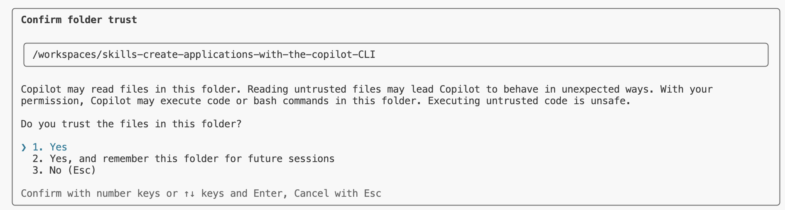
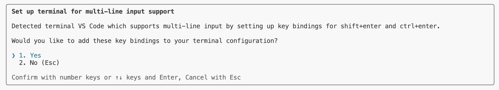
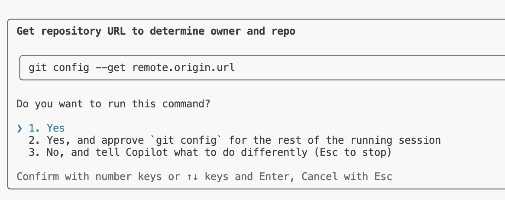

## Passo 1: Instalar o Copilot CLI e Usar o Issue Template

Joãozinho prefere trabalhar no terminal e quer usar IA nele.
Ele está se preparando para desenvolver uma nova aplicação de calculadora CLI em Node.js e planeja instalar a versão standalone do Copilot CLI para construir a aplicação pelo terminal.

### 📖 Teoria: GitHub Copilot CLI - Uma Aplicação Standalone de Terminal

#### O que é o GitHub Copilot CLI?

O GitHub Copilot CLI é uma **aplicação standalone de terminal** que leva o poder do GitHub Copilot diretamente para a sua linha de comando. Ele é instalado via npm e oferece uma experiência interativa robusta para desenvolvedores.


#### Principais capacidades e opções incluem:

- Fornecer sugestões inteligentes de comandos alimentadas pelos modelos de IA mais recentes da OpenAI e Google
- Gerar trechos de código e scripts diretamente no seu terminal
- Auxiliar com operações Git e interações com o GitHub
- Suportar entrada de imagens via colar e arrastar e soltar para contexto visual
- A flag `--enable-all-github-mcp-tools` habilita todas as ferramentas GitHub MCP (Model Context Protocol), dando ao Copilot CLI acesso a recursos do GitHub, como criar issues, gerenciar repositórios e muito mais.
- Dependendo da sua configuração do Copilot CLI (por exemplo, se você não usar a opção `--allow-all`), você pode ser solicitado a habilitar certos recursos durante a sessão. Responda **yes** a esses prompts também.
- `/session`: Mostra detalhes sobre sua sessão de chat atual.
- `/context`: Fornece uma visão geral visual do uso atual de tokens
- `/usage`: Permite visualizar as estatísticas da sua sessão, incluindo:
   - A quantidade de requisições premium usadas na sessão atual
  - A duração da sessão
  - O total de linhas de código editadas
   - Um detalhamento do uso de tokens por modelo
- `/share [file|gist] [path]` - Compartilha a sessão em arquivo markdown ou GitHub gist
- Criar **custom agents** para codificar prompts e fluxos de trabalho especializados
- Delegar tarefas ao **Copilot coding agent** usando o comando `/delegate`

#### Atalhos globais

```text
 @             mencionar arquivos, incluir conteúdo no contexto
 Esc           cancelar a operação atual
 !             executar comando no seu shell local (ignorar o Copilot)
 ctrl+c        cancelar operação / limpar entrada / sair
 ctrl+d        encerrar
 ctrl+l        limpar a tela
 shift+tab     alternar entre o modo plan e o modo interativo regular
```

#### Requisitos de Instalação

Para instalar o Copilot CLI, você precisa de:

- Node.js versão 22 ou posterior
- npm versão 10 ou posterior
- Uma assinatura ativa do GitHub Copilot (Pro, Pro+, Business ou Enterprise)

#### Issue Templates

Issue templates ajudam a manter a consistência quando membros da equipe criam issues. Este repositório já possui um template `feature_request.md` que você usará para criar a issue da sua aplicação calculadora. Templates garantem:

- Todas as informações necessárias são capturadas desde o início
- Issues seguem um formato padrão
- A equipe pode fazer triagem e responder às issues de forma mais eficiente

#### Referências

- [Installing GitHub Copilot CLI](https://docs.github.com/en/copilot/how-tos/set-up/install-copilot-cli)
- [Using GitHub Copilot CLI](https://docs.github.com/en/copilot/how-tos/use-copilot-agents/use-copilot-cli)
- [GitHub Copilot CLI 101](https://github.blog/ai-and-ml/github-copilot-cli-101-how-to-use-github-copilot-from-the-command-line/)

> [!IMPORTANT]
> Se você reiniciou seu codespace, pode ser necessário executar `copilot --allow-all` e depois autenticar com o GitHub novamente executando `!gh auth login` no seu terminal,
> ou usar `!gh auth login` de dentro da sessão do Copilot CLI.

### :keyboard: Atividade 1: Conhecendo seu ambiente de desenvolvimento

1. Clique com o botão direito no botão abaixo para abrir a página **Create Codespace** em uma nova aba.

   [](https://codespaces.new/{{full_repo_name}}?quickstart=1)
   - O plano gratuito de Codespaces que vem com todas as contas GitHub é suficiente, assumindo que você ainda tem minutos disponíveis.
   - As configurações padrão do Codespace são suficientes.

> [!IMPORTANT]
> Este ambiente do VS Code no Codespace foi simplificado para focar no uso do Copilot CLI no terminal. Você trabalhará principalmente com comandos de terminal, em vez de usar o conjunto completo de recursos do VS Code.

1. Confirme que o campo **Repository** é a sua cópia do exercício, não o original, e clique no botão verde **Create Codespace**.
   - ✅ Sua cópia: `/{{full_repo_name}}`
   - ❌ Original: `/arilivigni/create-applications-with-the-copilot-CLI`

1. Aguarde um momento para o Visual Studio Code carregar.

1. Vamos focar na janela completa do terminal, já que este exercício é totalmente voltado ao CLI.

### ⌨️ Atividade 2: Instalar o Copilot CLI Standalone

1. Abra seu Codespace, caso ainda não esteja aberto.

1. Instale a versão standalone do GitHub Copilot CLI executando o comando na janela do terminal:

   > 

   > ```bash
   > npm install -g @github/copilot
   > ```

1. Verifique a instalação executando:

   > 

   > ```bash
   > copilot --version
   > ```

> [!TIP]
> Após a instalação, você pode usar o comando `copilot` em qualquer lugar do terminal para iniciar uma sessão interativa.

### ⌨️ Atividade 3: Criar uma Issue Usando o Copilot CLI

1. Inicie uma sessão interativa do Copilot CLI:

   > 
   >
   > ```bash
   > copilot --enable-all-github-mcp-tools
   > ```

> [!NOTE]
> Ao iniciar o Copilot CLI, você pode ser solicitado a adicionar esta pasta à lista de pastas confiáveis e às combinações de teclas. Responda **yes** a ambos os prompts para continuar.


<br />



2. Autorize com o GitHub (se ainda não estiver autenticado) no Copilot CLI:

   > 
   >
   > ```prompt
   > /login
   > ```

> [!NOTE]
> Após executar `!gh auth login`, você receberá um link e um código de autenticação. Clique no link para abrir o GitHub no navegador e insira o código para concluir o processo de autenticação.

3. Explore comandos slash úteis no Copilot CLI:
   - Visualize as informações da sua sessão atual:

     > 
     >
     > ```prompt
     > /session
     > ```

   - Visualize as informações do contexto atual:

     > 
     >
     > ```prompt
     > /context
     > ```

   - Visualize as informações de uso atuais:

     > 
     >
     > ```prompt
     > /usage
     > ```

> [!NOTE]
>
> - `/session`: Comando que mostra detalhes sobre sua sessão de chat atual.
> - `/context`: Fornece uma visão geral visual do uso atual de tokens.
> - `/usage`: Permite visualizar as estatísticas da sua sessão, incluindo:
>   - A quantidade de requisições premium usadas na sessão atual
>   - A duração da sessão
>   - O total de linhas de código editadas
>   - Um detalhamento do uso de tokens por modelo

4. Peça ao Copilot CLI para ajudar você a criar uma issue de feature request para a aplicação de calculadora:

   > 
   >
   > ```prompt
   > Crie uma GitHub issue para uma aplicação de calculadora CLI em Node.js usando o seguinte template
   > .github/ISSUE_TEMPLATE/feature_request.md e certifique-se de que a issue esteja em
   > formato Markdown, contendo "calculator" no título e seguindo o formato do
   > issue template.
   > Eu quero solicitar um recurso para operações aritméticas básicas incluindo
   > - addition
   > - subtraction
   > - multiplication
   > - division
   > A calculadora deve ser implementada em calculator.js
   > Crie a issue diretamente para o owner e o repositório atuais nesta sessão
   > no github.com usando os comandos da `gh` CLI.
   > Liste o link da issue quando ela estiver pronta
   > ```

5. A Mona já deve estar verificando seu trabalho. Aguarde um momento e acompanhe os comentários. Você verá a resposta dela com informações de progresso e a próxima lição.

> [!NOTE]
> O Copilot CLI pode pedir que você confirme a criação da issue e o uso de `gh issue` e `git config`.
> Responda **yes** para criar a issue e
> **"Yes, and approve `gh issue` or `git config` for the rest of the running session"**.



<details>
<summary>Está com problemas? 🤷</summary><br/>

- Certifique-se de que o Node.js 22+ está instalado: `node --version`
- Se a instalação com npm falhar, tente: `sudo npm install -g @github/copilot`
- Certifique-se de que o acesso ao GitHub Copilot está habilitado para a sua conta
- Se a autenticação falhar, execute `copilot` e depois `!gh auth login`
- Você também pode criar a issue pela interface do GitHub, se necessário

</details>
